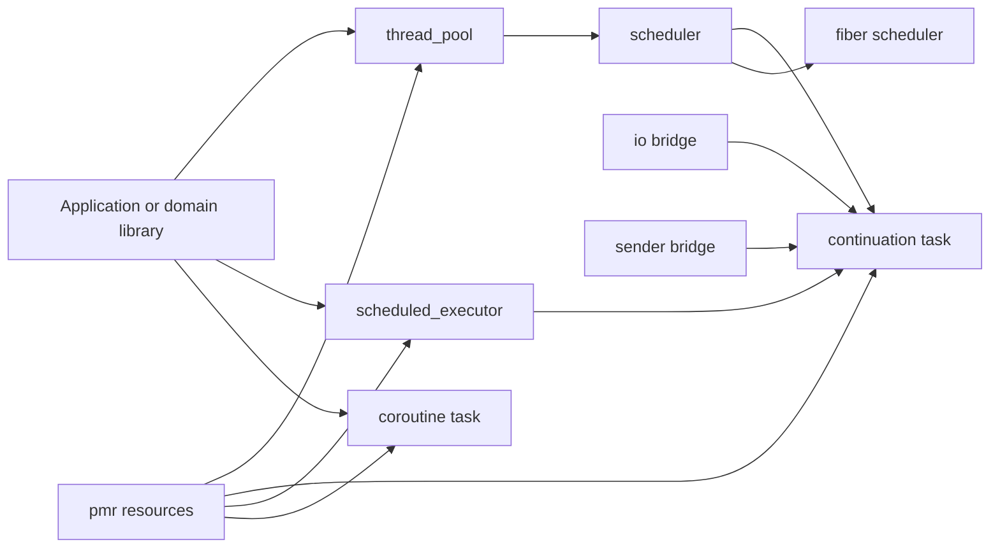

# Architecture And API Notes

This directory contains architecture and API notes for `modern_runtime`, a modular C++23 runtime core for schedulers, thread pools, timers, continuation pipelines, coroutine-native tasks, and adapter-based async integration.

This document intentionally does not cover build or packaging instructions. Use the repository root README for setup and command-level guidance.

## Scope Of The Runtime

`modern_runtime` owns the runtime substrate that domain libraries can build on top of:

- execution handoff through a small scheduler abstraction
- worker-thread based CPU execution
- delayed and periodic scheduling
- continuation-oriented async composition with `task<T>`
- coroutine-native runtime tasks with environment propagation
- PMR-aware allocation hooks across task, scheduler, timer, and adapter paths
- bridges for completion-based I/O, sender/receiver sources, and cooperative fibers

`modern_runtime` does not try to replace a networking, filesystem, or protocol library. Instead, it gives those layers a consistent execution, timing, cancellation, and memory model.

## Design Goals

- Keep execution concerns separate from domain logic.
- Let CPU work, timer work, and completion-based async work share one runtime vocabulary.
- Make allocator control explicit and propagate PMR resources through async chains.
- Support both continuation style and coroutine style without forcing one model.
- Keep integrations adapter-driven so external systems can plug in without rewriting the runtime.
- Expose narrow module boundaries so consumers can import only what they need.

## Module Map

| Module | Purpose | Main public surface |
| --- | --- | --- |
| `modern.exec` | Small execution abstraction | `scheduler`, `scheduler_priority`, `inline_scheduler()` |
| `modern.thread` | Thread-pool backed execution | `thread_pool` |
| `modern.task` | Continuation-based async tasks | `task<T>`, `submit(...)`, `task_scope` |
| `modern.timer` | Delayed and periodic scheduling | `scheduled_executor` |
| `modern.runtime` | Umbrella and adapter layer | `schedule_after(...)`, `bind_io(...)`, `adapt_modern_io(...)`, `as_task(...)`, `fiber_scheduler`, `runtime::Task<T>` |
| `modern.memory` | PMR-oriented helpers | `arena`, `pool`, `get_default_resource()` |
| `modern.sync` | Small synchronization surface | `manual_reset_event` |
| `modern.platform` | Platform utilities used by the runtime | `now()`, `sleep_for()`, `yield()`, `current_cpu()`, `set_thread_affinity()` |

If you want the full runtime surface, import the umbrella module:

```cpp
import modern.runtime;
```

If you want tighter compile-time boundaries, import only the modules you need:

```cpp
import modern.exec;
import modern.task;
import modern.thread;
import modern.timer;
import modern.memory;
import modern.sync;
import modern.platform;
```

## Architecture At A Glance



The key architectural idea is that `scheduler` is the common execution currency. Thread pools produce schedulers, timers target schedulers, task continuations run on schedulers, and runtime bridges complete back onto schedulers.

## Core Execution Model

### 1. `scheduler` Is The Common Currency

`modern::scheduler` is a small type-erased execution handle. It can wrap any executor-like object that exposes `execute(task)`, and it can also forward priorities when the underlying executor supports them.

What matters operationally:

- it is the stable handoff type between modules
- it can carry a PMR resource when the wrapped executor exposes `resource()`
- it supports `scheduler_priority::high`, `scheduler_priority::normal`, and `scheduler_priority::low`
- it can be used directly, or obtained from higher-level runtime components such as `thread_pool`

Use `inline_scheduler()` when you want a scheduler that executes immediately on the current thread. It is useful for tests, tiny glue paths, or purely inline task chains.

### 2. `thread_pool` Owns Workers, Queues, And Priorities

`modern::thread_pool` is the main CPU execution engine.

Important behaviors:

- configurable worker count
- optional PMR resource for runtime allocations
- optional maximum pending task count
- optional worker affinity mapping
- prioritized execution through `scheduler_priority`
- work stealing across per-worker queues

The constructor shape is:

```cpp
modern::thread_pool pool{
  thread_count,
  resource,
  max_pending_tasks,
  worker_affinity
};
```

Operational notes:

- call `shutdown()` and then `join()` when you are done with the pool
- if the bounded queue is full, submission currently fails instead of back-pressuring the caller
- affinity is a best-effort platform feature and should be treated as a runtime optimization, not an API guarantee

### 3. `scheduled_executor` Adds Time-Based Work

`modern::scheduled_executor` targets a `scheduler` or a `thread_pool` and owns the timing layer.

It serves two different use cases:

- fire-and-forget callbacks through member functions such as `schedule_at(...)` and `schedule_after(...)`
- task-returning delayed work through the free `modern::schedule_at(...)` and `modern::schedule_after(...)` adapters exported by the runtime umbrella

It also supports periodic execution through `schedule_fixed_rate(...)`, which returns a `periodic_handle` that can be stopped cooperatively.

### 4. `task<T>` And `runtime::Task<T>` Solve Different Problems

The project deliberately keeps two async composition styles:

- `modern::task<T>` is a continuation-first type for pipeline building with `then(...)`, `catching(...)`, and `finally(...)`
- `modern::runtime::Task<T>` is a coroutine-native type with explicit runtime environment propagation

Choose `modern::task<T>` when:

- your flow is naturally a pipeline of transformations
- you want lightweight chaining without writing coroutines
- you are adapting callbacks, timers, senders, or scheduler work into one chain

Choose `modern::runtime::Task<T>` when:

- you want a native coroutine return type
- you need access to `TaskEnvironment`, trace context, or frame allocator control
- you want expected-based aliases through `ResultTask<T, E>` or `StatusTask<E>`

### 5. Bridges Convert Other Async Models Into Runtime Tasks

The runtime layer exposes several bridges rather than owning domain-specific I/O implementations:

- `bind_io<R>(...)` turns a completion-based start function into `task<R>`
- `adapt_modern_io(service)` wraps services that expose `start(...)` or `submit(...)`
- `adapt_modern_io_uring(service)` validates that the service is `io_uring`-backed
- `adapt_modern_io_poller(service)` validates `epoll` or `kqueue` style backends
- `as_task<R>(sender, ...)` turns a sender into `task<R>`
- `fiber_scheduler` provides cooperative rescheduling over an existing scheduler

This is the intended extension line for domain libraries: keep transport, filesystem, or protocol logic outside `modern_runtime`, then adapt those services into its task model.

## API Notes By Module

### `modern.exec`

Use `modern.exec` when you need the smallest public execution surface.

Key types and functions:

- `scheduler`
- `scheduler_priority`
- `inline_scheduler()`

Key properties of `scheduler`:

- wraps an executor-like implementation behind a value type
- exposes `execute(task)` and `execute(priority, task)`
- forwards the underlying PMR resource when available
- remains intentionally small so higher-level modules can depend on it without pulling in thread or timer ownership

### `modern.thread`

Use `modern.thread` when you need owned worker threads.

Key type:

- `thread_pool`

Main operations:

- `get_scheduler()` to hand a generic scheduler to other parts of the system
- `execute(...)` or `execute(priority, ...)` for direct fire-and-forget submission
- `shutdown()` and `join()` for lifecycle management
- `resource()` to expose the pool's PMR resource

Practical guidance:

- prefer passing the scheduler into other abstractions instead of exposing the whole pool everywhere
- keep pool ownership at application boundaries
- use worker affinity only when you have measured a benefit and understand the platform constraints

### `modern.task`

Use `modern.task` when you want continuation-oriented async composition.

Key types and functions:

- `task<T>`
- `task<void>`
- `submit(...)`
- `task_scope`

`task<T>` supports:

- `get()` to wait and extract the value
- `then(...)` to transform the successful result
- `catching(...)` to recover from exceptions
- `finally(...)` to run cleanup or notification logic
- coroutine return semantics for `modern::task<T>` itself

Important behavioral notes:

- tasks are move-only and effectively single-consumer
- continuations default to the parent task's scheduler and memory resource
- `then(...)`, `catching(...)`, and `finally(...)` also accept explicit `memory_resource*` overrides
- `submit(...)` has overloads for `scheduler` and `thread_pool`, with optional `stop_token` and optional `memory_resource*`
- cancellation is pre-start cancellation: if a stop token is already triggered or fires before the work begins, the task completes as cancelled; already running work is not forcibly interrupted

`task_scope` is the structured-concurrency helper for groups of child jobs.

Behavior of `task_scope`:

- `spawn(...)` starts child work on the scope scheduler
- if one child throws, the first exception is recorded
- the scope requests stop for the remaining children
- `join()` waits for all children and then rethrows the recorded exception
- the destructor also requests stop and joins

### `modern.timer`

Use `modern.timer` when you need delayed or periodic scheduling.

Key type:

- `scheduled_executor`

Main operations:

- `schedule_at(...)` for absolute due times
- `schedule_after(...)` for relative delays
- `schedule_fixed_rate(...)` for periodic work
- `shutdown()` and `join()` for lifecycle management

The member functions schedule callbacks directly. If you want a task-returning delayed operation that composes with `then(...)`, use the free runtime adapters `modern::schedule_at(...)` or `modern::schedule_after(...)`.

Behavioral notes:

- free task-returning timer adapters inherit the executor resource by default
- stopping the `scheduled_executor` before a delayed task becomes due completes that task with an exception
- periodic work is cooperative; `request_stop()` on the returned `periodic_handle` tells the repeating job to stop scheduling future executions

### `modern.runtime`

Use `modern.runtime` when you want the full umbrella surface or one of the adapter-heavy runtime slices.

Key coroutine types:

- `modern::runtime::Task<T>`
- `modern::runtime::Task<void>`
- `modern::runtime::ResultTask<T, E>`
- `modern::runtime::StatusTask<E>`

Key coroutine environment types:

- `TaskEnvironment`
- `TraceContext`
- `TaskEnvironmentScope`
- `FrameMemoryResourceScope`
- `TraceContextScope`
- `current_task_environment()`
- `current_trace_context()`

Important `runtime::Task<T>` properties:

- coroutine execution is lazy until the task is started through `co_await`, `start()`, `get()`, or `sync_wait()`
- the task object exposes `environment()` and `set_environment(...)`
- trace context can be injected with `set_trace_context(...)`
- frame allocation uses the active frame memory resource, which can be overridden with `FrameMemoryResourceScope`

Key bridge entry points:

- `bind_io<R>(completion_scheduler, resource, start)`
- `adapt_modern_io(service)`
- `adapt_modern_io_uring(service)`
- `adapt_modern_io_poller(service)`
- `as_task<R>(sender, completion_scheduler, resource)`
- `fiber_scheduler`

`fiber_scheduler` is intentionally cooperative. A fiber yields by calling `fiber_context::yield()`, and stop becomes observable at the next resume boundary.

### `modern.memory`

Use `modern.memory` when you want the runtime's PMR-aligned helper surface.

Key types and functions:

- `memory_resource`
- `polymorphic_allocator<T>`
- `get_default_resource()`
- `new_delete_resource()`
- `arena`
- `pool`

`arena` wraps a monotonic buffer resource and is a good fit for short-lived burst allocations. `pool` wraps an unsynchronized pool resource and is a good fit for repeated small allocations with reuse.

### `modern.sync` And `modern.platform`

These modules are intentionally small, but they matter at integration boundaries.

`modern.sync` currently exposes `manual_reset_event`, which is useful in tests and in outer orchestration code where a blocking wait is appropriate.

`modern.platform` exposes utilities that the runtime itself uses and that callers can also use when needed:

- `now()`
- `sleep_for(...)`
- `yield()`
- `hardware_concurrency()`
- `current_cpu()`
- `set_thread_affinity(...)`

## Helpful Examples

### Continuation Pipeline On A Thread Pool

This is the default continuation-style workflow: submit CPU work, transform the result, recover if needed, and run a final side effect.

```cpp
import modern.runtime;

#include <exception>
#include <iostream>
#include <stdexcept>

int main()
{
  modern::thread_pool cpu{4};

  auto value = modern::submit(cpu, []
    {
      return 21;
    })
    .then([](int x)
    {
      return x * 2;
    })
    .catching([](std::exception_ptr ep)
    {
      if (ep)
        std::rethrow_exception(ep);

      return 0;
    })
    .finally([]
    {
      std::cout << "pipeline finished\n";
    })
    .get();

  std::cout << value << "\n";

  cpu.shutdown();
  cpu.join();
}
```

Why this example matters:

- the first submission returns `task<int>`
- `then(...)` transforms the success value
- `catching(...)` observes exceptions from upstream work
- `finally(...)` runs regardless of success or failure

### Delayed And Periodic Scheduling

Use a `scheduled_executor` when time is part of the contract.

```cpp
import modern.runtime;

#include <chrono>
#include <iostream>
#include <string>

int main()
{
  using namespace std::chrono_literals;

  modern::thread_pool cpu{2};
  modern::scheduled_executor timers{cpu};

  auto delayed = modern::schedule_after(timers, 100ms, []
    {
      return std::string{"ready"};
    })
    .then([](std::string text)
    {
      return text + " after timer";
    })
    .get();

  std::cout << delayed << "\n";

  int ticks = 0;
  auto periodic = timers.schedule_fixed_rate(0ms, 50ms, [&]
    {
      ++ticks;
    });

  modern::platform::sleep_for(180ms);
  periodic.request_stop();

  timers.shutdown();
  timers.join();
  cpu.shutdown();
  cpu.join();
}
```

Use the free `modern::schedule_after(...)` adapter when you want a task result. Use the member `schedule_fixed_rate(...)` when you want a repeating callback.

### Structured Concurrency With `task_scope`

`task_scope` is the right tool when a group of child jobs should fail and stop together.

```cpp
import modern.runtime;

#include <atomic>
#include <chrono>
#include <stdexcept>

int main()
{
  using namespace std::chrono_literals;

  modern::thread_pool cpu{2};
  modern::task_scope scope{cpu.get_scheduler()};
  std::atomic<bool> cancelled = false;

  scope.spawn([&](std::stop_token token)
    {
      while (!token.stop_requested())
        modern::platform::sleep_for(1ms);

      cancelled.store(true, std::memory_order_relaxed);
    });

  scope.spawn([]
    {
      throw std::runtime_error("scope boom");
    });

  try
  {
    scope.join();
  }
  catch (const std::runtime_error&)
  {
    // join() rethrows the first child failure after all children complete.
  }

  cpu.shutdown();
  cpu.join();
}
```

The important point is not just that `scope.join()` fails. It also requests stop for sibling work, which lets long-running children observe cancellation cooperatively.

### Coroutine-Native Runtime Task With Trace Context

Use `modern::runtime::Task<T>` when you want lazy coroutine execution and runtime context propagation.

```cpp
import modern.runtime;

#include <cstddef>
#include <optional>

modern::runtime::Task<std::optional<modern::runtime::TraceContext>> read_trace()
{
  co_return co_await modern::runtime::current_trace_context();
}

int main()
{
  modern::runtime::TraceContext trace;
  trace.trace_id[0] = std::byte{0x4b};
  trace.span_id[0] = std::byte{0x2a};
  trace.flags = 1;

  auto task = read_trace();
  task.set_trace_context(trace);

  auto inherited = task.sync_wait();
  return inherited ? 0 : 1;
}
```

This example shows the difference from `modern::task<T>`: the coroutine task carries runtime environment state as a first-class concept.

### Adapting A Completion-Based Service

A service can keep its domain-specific API and still participate in the runtime through `adapt_modern_io(...)`.

```cpp
import modern.runtime;

struct fake_service
{
  modern::scheduler scheduler_;
  modern::memory::memory_resource* resource_;

  modern::scheduler get_scheduler() const
  {
    return scheduler_;
  }

  modern::memory::memory_resource* resource() const noexcept
  {
    return resource_;
  }

  template<class Completion>
  void start(int value, Completion completion)
  {
    scheduler_.execute([completion = std::move(completion), value]() mutable
    {
      completion.set_value(value + 1);
    });
  }
};

int main()
{
  modern::thread_pool cpu{2};
  fake_service service{cpu.get_scheduler(), modern::memory::get_default_resource()};

  auto io = modern::adapt_modern_io(service);
  int value = io.submit<int>(41).get();

  cpu.shutdown();
  cpu.join();
  return value == 42 ? 0 : 1;
}
```

The adapter detects either `start(operation, completion)` or `submit(operation, completion)`. If the service also supports `stop_token` overloads, cancellation can propagate into the start path before work begins.

### Cooperative Fiber Scheduling

`fiber_scheduler` is useful when you want very small cooperative units over an existing scheduler.

```cpp
import modern.runtime;

#include <string>

int main()
{
  modern::thread_pool cpu{1};
  modern::fiber_scheduler fibers{cpu.get_scheduler()};
  std::string order;

  fibers.spawn([&](modern::fiber_context& context)
    {
      order += "A";
      context.yield();
      order += "A";
    });

  fibers.spawn([&](modern::fiber_context& context)
    {
      order += "B";
      context.yield();
      order += "B";
    });

  fibers.join();
  cpu.shutdown();
  cpu.join();
}
```

The important constraint is that this is cooperative, not preemptive. A fiber runs until it returns or explicitly yields.

## Operational Guidance

- Keep `thread_pool` and `scheduled_executor` ownership at application boundaries.
- Pass `scheduler` into lower layers when they only need execution, not worker ownership.
- Use `task<T>` for pipeline-style composition and `runtime::Task<T>` for coroutine-first flows.
- Treat `stop_token` support as cooperative. The runtime cancels before execution starts; long-running work must still check the token itself.
- Let the default PMR propagation work unless you need separate accounting or allocation isolation. Override `memory_resource*` only when you have a concrete reason.
- Prefer adapters over duplicate runtime stacks. If you already have a callback- or sender-based async source, bridge it into the runtime rather than re-implementing scheduling logic.

## Reading Guide

If you want to continue from this document into the codebase, these files are the most useful anchors:

- [../modules/modern.runtime.cppm](../modules/modern.runtime.cppm) for the umbrella import surface
- [../modules/exec/api.cppm](../modules/exec/api.cppm) for the scheduler abstraction
- [../modules/task/continuation.cppm](../modules/task/continuation.cppm) for `task<T>`, `submit(...)`, and `task_scope`
- [../modules/thread/api.cppm](../modules/thread/api.cppm) for `thread_pool`
- [../modules/timer/api.cppm](../modules/timer/api.cppm) and [../modules/runtime/timer_adapter.cppm](../modules/runtime/timer_adapter.cppm) for timing surfaces
- [../modules/runtime/coroutine_task.cppm](../modules/runtime/coroutine_task.cppm) for `runtime::Task<T>` and environment propagation
- [../modules/runtime/io_bridge.cppm](../modules/runtime/io_bridge.cppm), [../modules/runtime/modern_io_adapter.cppm](../modules/runtime/modern_io_adapter.cppm), and [../modules/runtime/sender_bridge.cppm](../modules/runtime/sender_bridge.cppm) for adapters
- [../examples/async_demo.cpp](../examples/async_demo.cpp) for a runnable end-to-end sample
- [../tests/smoke_test.cpp](../tests/smoke_test.cpp) for behavior-oriented usage patterns
